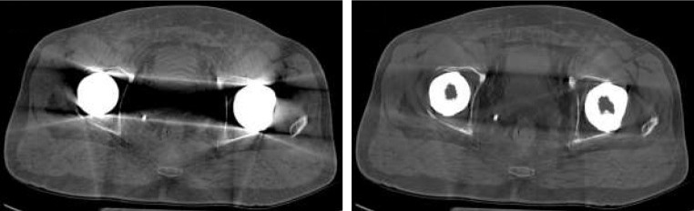

<br>
<sub>*Adapted from Wellenberg et al., Skeletal Radiology 48:1775 (2019) [[DOI](https://doi.org/10.1007/s00256-019-03206-z)] · [CC BY 4.0](https://creativecommons.org/licenses/by/4.0/)*</sub>

# MAR ILS Dataset Generator and Evaluation Framework


## Overview

This is the **reference evaluation framework** for conducting standardized **Interlaboratory Studies (ILS)** on CT **Metal Artifact Reduction (MAR)** algorithms. Following the task-based signal detection framework of **Vaishnav et al. (Medical Physics, 2020)**, this toolset provides:

1.  **Standardized Dataset Generation:** Physics-based fan-beam sinogram synthesis (v7.0.0).
2.  **Reference MAR Algorithms:** Implementations of iMAR, MBIR, and Dual-Energy Spectral MAR.
3.  **Objective Statistical Scoring:** Quantifying lesion detectability ($\Delta AUC$) using a **Channelized Hotelling Observer (CHO)** with normative internal noise ($\sigma=15$).
4.  **AI-Native Diagnostics:** Integrated **Model Context Protocol (MCP)** servers for automated data auditing and visualization.

---

## April 2026 Status: Metrology Baseline Locked

The framework has officially transitioned from parallel-beam research tiers to a **Normative Fan-Beam Geometry** (SID=570mm, SDD=1040mm). 

### ILS Reference Baseline ($N=40$)
The following values are established as the normative floor for ASTM WKXXXXX Rev 04:

| Metric | Value | Status |
| :--- | :--- | :--- |
| **Baseline AUC_noMAR** | **0.8294** | **LOCKED** |
| **95% Confidence Interval** | [0.7612, 0.9025] | Verified |
| **Lesion Contrast** | 12.0 HU | Normative |
| **Integrity Check** | SHA-256 | Validated |

---

## Performance Breakthrough: Numba Acceleration
The v7.0.0 engine features a JIT-compiled **Batch Backprojector** optimized for Apple Silicon (M3) and modern x86_64 architectures, providing a **24x speedup** over standard NumPy implementations.

* **Throughput:** ~61s per realization (256 slices).
* **Efficiency:** Full $N=40$ dataset generation in <30 minutes on standard workstations.

## Quick Start

```bash
# Generate the canonical fan-beam dataset
python generator_v7_0_0.py --output-dir ./astm_reference_dataset

# Self-test (validates CHO pipeline — ΔAUC = 0 by definition)
python run_cho_analysis_v7_0.py \
    --dataset-dir ./astm_reference_dataset \
    --self-test --internal-noise-sigma 15

# ILS mode (score your MAR algorithm)
python run_cho_analysis_v7_0.py \
    --dataset-dir ./astm_reference_dataset \
    --mar-output-dir ./mar_recon \
    --internal-noise-sigma 15
```

---

## AI-Integrated Laboratory (MCP)
This repository includes **Model Context Protocol (MCP)** servers, allowing AI assistants to act as "Laboratory Hands" on your local workstation.

* **Data Inspector (`mcp_data_inspector.py`):** Automatically parses CHO JSON results and summarizes statistical significance.
* **Visualization (`mcp_visualization.py`):** Renders HDF5 sinogram slices and ROI comparisons directly in the AI chat interface.

---

## Validation & Audit Tools
To ensure inter-laboratory consistency, use the following in-memory physics auditors:
* **`plot_spectral_transparency.py`:** Visualizes the "Transparency Jump" between 60 keV and 140 keV.
* **`check_metal_overflow.py`:** Audits the normative **3000 HU metal-ROI hard-set** requirement.

---

## Deliverables & Repository Structure

| Path | Description |
| :--- | :--- |
| `generator_v7_0_0.py` | **Normative** fan-beam dataset generator (Rev 04). |
| `run_cho_analysis_v7_0.py` | **Normative** 2D CHO scoring tool (Rev 04). |
| `patch_2026b_metadata.py` | One-time DICOM 2026b CP-2575 metadata patcher. |
| `docs_and_references/ASTM_MAR_Standard.md` | Draft standard text (Rev 04, machine-readable) |
| `docs_and_references/IEC_203_6_7_101_compliance_statement_proposal.md` | Post-publication Corrigendum/Amendment proposal for §203.6.7.101.1 (deferred until ASTM FXXXX publishes) |
| `docs_and_references/FDA_guidance_framework.md` | Draft FDA guidance for acceptance criteria |
| `/algorithms` | Reference MAR implementations (iMAR, MBIR, Spectral). |
| `/legacy` | Archived v6.0.0 parallel-beam research framework. |

---

## Metadata Standard: DICOM 2026b Compliant

This is the **first reference implementation** of the **DICOM CP-2575 Metal Artifact Reduction Macro** (PS3.3 C.8.15.3.15), finalized in DICOM 2026b.

All DICOM files produced by the generator and the `patch_2026b_metadata.py` utility include:

| Tag | Keyword | Value |
| :--- | :--- | :--- |
| `(0018,9390)` | Metal Artifact Reduction Sequence | Present (1 item) |
| `(0018,9391)` | Metal Artifact Reduction Applied | `NO` |

The `noMAR` reconstructions are tagged `NO` by definition. Laboratories applying MAR algorithms must set `(0018,9391)` to `YES` and optionally populate `(0018,9392)` Metal Artifact Reduction Algorithm with a value from **CID 10036** (e.g., `MAR_IMAR`, `MAR_SPECTRAL`).

### Verification (hex-tag method)

Because pydicom's bundled data dictionary does not yet include the 2026b additions, auditing requires hex-tag access:

```python
import pydicom
ds = pydicom.dcmread('astm_reference_dataset/noMAR_recon/LP/realization_001/slice_0129.dcm')

# Access the MAR Macro via hex tags
mar_seq = ds[0x00189390]                          # Metal Artifact Reduction Sequence
mar_applied = mar_seq.value[0][0x00189391].value   # → "NO"
print(f'(0018,9391) Metal Artifact Reduction Applied = {mar_applied}')
```

---

## Regulatory Framework

| Layer | Document | Role |
|-------|----------|------|
| **1 — What to record** | DICOM CP-2575 (2026b) | MAR metadata tags in DICOM |
| **2 — Must have / describe / record** | IEC 60601-2-44 Ed. 4 §203.6.7.101 (.1 method, .2 user info, .3 DICOM) | Regulatory mandate |
| **3 — How to measure (post-publication binding to §203.6.7.101.1)** | ASTM FXXXX (formerly WKXXXXX Rev 04) — Corrigendum/Amendment submitted after ASTM FXXXX publishes | Quantitative ΔAUC TYPE TEST |
| **4 — Acceptance** | FDA guidance (proposed) | Non-degradation / superiority thresholds |

---

## Technical Contact

**Christopher D. Cocchiaraley** Consumer Member, ASTM International Committee F04  
Executor of the Estate of Veronica M. Cocchiaraley
